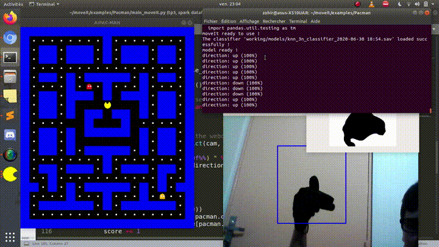
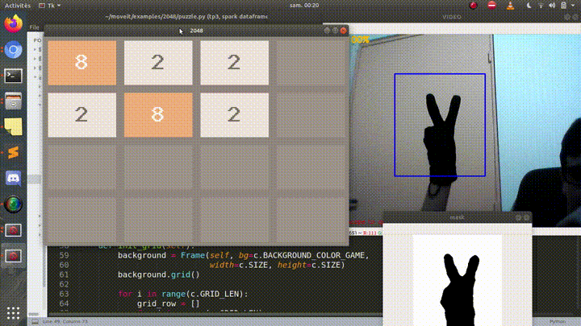

MoveIt
===========

The main objective of this library is to allow the user to control some applications / games with his webcam.
MoveIt is based on artificial intelligence and offers two classes : 
* **MoveIt_ML :** based on K-nearest neighbors algorithm (machine learning).
* **MoveIt_DL :** based on a convolutional neural network (deep learning).

Install
===========    
    $ pip install moveitpa

To explore, run:
    
    $ python3 test_MoveIt_ML.py
    or
    $ python3 test_MoveIt_DL.py

Documentation
===========    
More information can be found on the  [official documentation.](documentation.md)

Examples of use
===========    
Here [two examples](examples/) of deploying the library  [official documentation.]
### Pacman

### [2048](https://github.com/yangshun/2048-python)

Contributors:
==

- [Zohir MALTI](https://github.com/zohir-MALTI)
- [Djamel RAAB](https://github.com/DjamelRAAB)
